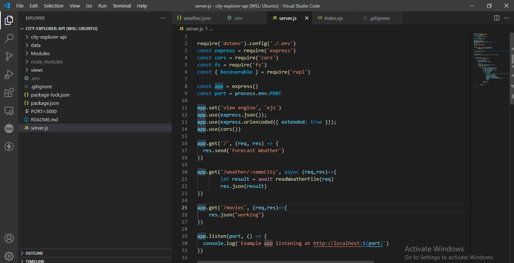
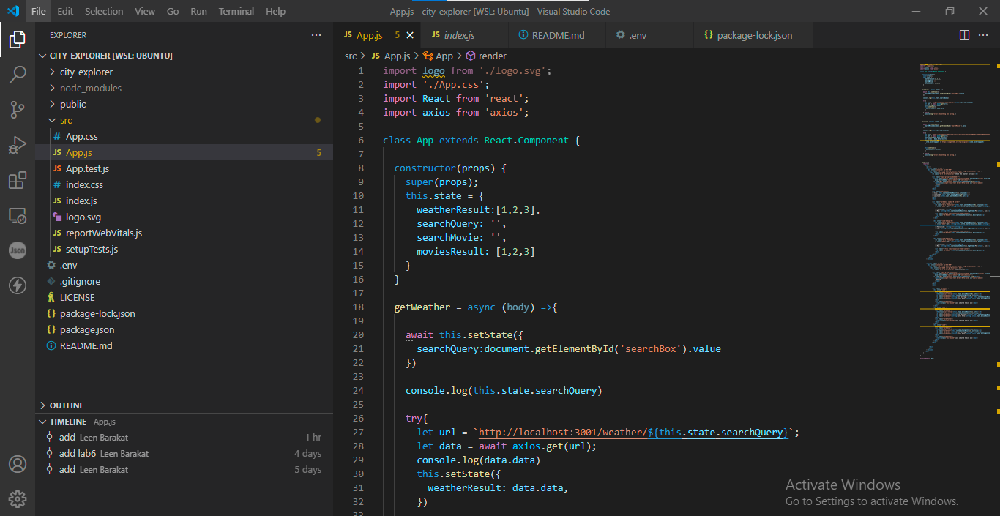
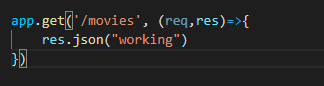
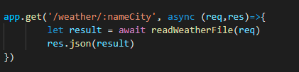
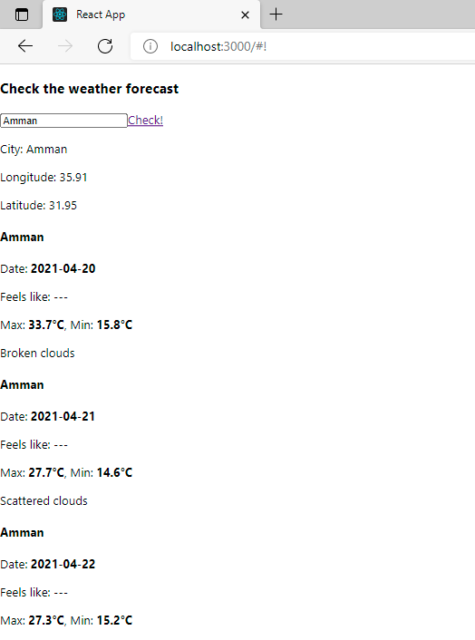

# WhiteBox Testing 

## 1- As you can see in here my code doesn't have any errors 

***Backend***

***Frontend***

## 2- Here I have tested if the PORT is working on the Ubuntu terminal by sending a request through npm start and if it works it should send the sentence below 

## 3- Here to make sure that the movies request gets the data from the third API 

## 4- Here to check that the app gets the data from the weather (weather.json)

# BlackBox testing

## 1- Here I made sure that all the weather information are on screen for the user 

## 2- Here I made sure that all the data about the movie are on screen 

**Search**

**Movie image**

**Movie Data**

